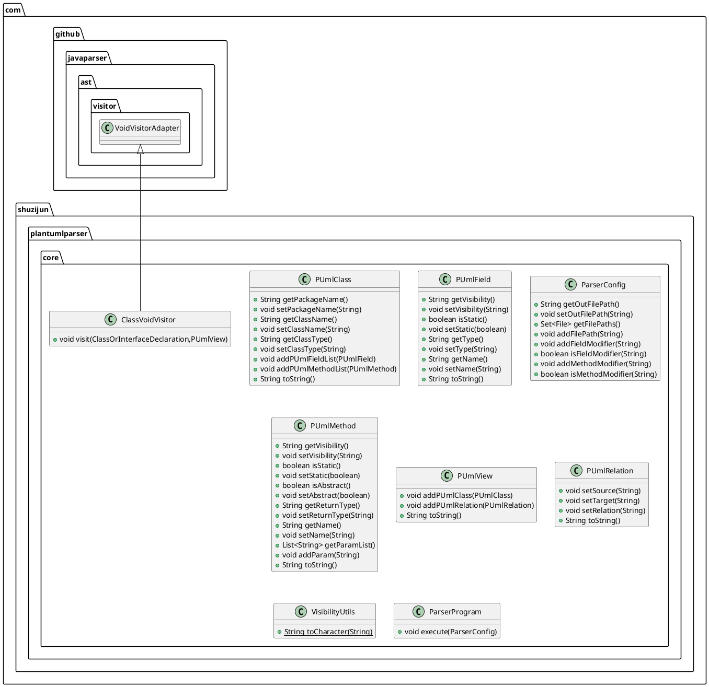

# plantuml-parser 

将Java源代码转换为plantuml  
Convert the Java source code to Plantuml

## plantuml-parser-core

```java
    public static void main(String[]args)throws IOException{
        ParserConfig parserConfig=new ParserConfig();
        parserConfig.addFilePath(filePath or fileDirectory);
        parserConfig.setOutFilePath(out file path);
        parserConfig.addMethodModifier(private or protected or default or public );
        parserConfig.addFieldModifier(private or protected or default or public );

        ParserProgram parserProgram=new ParserProgram(parserConfig);
        parserProgram.execute();
        }
```

## plantuml-parser-plugin

<p align="center">
  
</p> 

## output
### demo  

